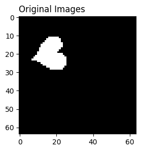
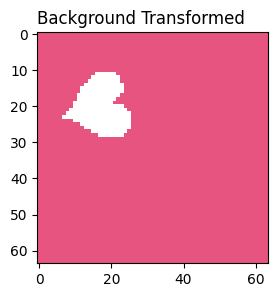
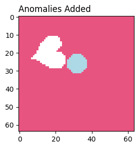
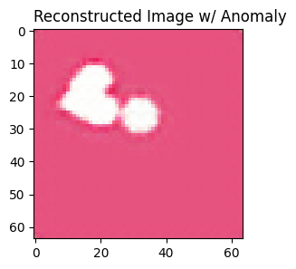
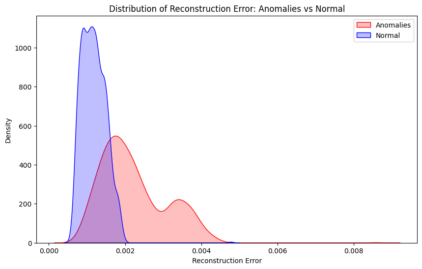

## Anomaly Detection in Video Game Sprites with Autoencoders (Pytorch)

Autoencoders are powerful neural networks designed to compress and reconstruct data, making them ideal for unsupervised anomaly detection. This article walks through how autoencoders learn compact image representations via encoding and decoding, how reconstruction error can be used to identify anomalies, and how kernel density estimation (KDE) can be applied to latent space representations. Using a custom dataset of manipulated dSprites and PyTorch, the article explores the relationship between latent space density, reconstruction loss, and visual anomaly detection—revealing where KDE succeeds and where it falls short. 

## Autoencoders 
Autoencoders are a type of deep neural network that consists of 3 different architectural components that work together to reconstruct an intial input. 

**The first component is known as the encoder.** 

This encoder ingests the input, which can vary greatly from tabular data to images. For the purposes of this article we will be focusing on autoencoders using images as input. 

**The second component is called the latent space.** 

If we take any image, even a particularly small one, for example a 28x28 pixel image. A flattened 28×28 pixel image will be represented as a 784-dimensional vector. Rather than having to deal with the image in all these dimensions, what the autocoder does is reduce the size of these dimenions and organizes the output in what was earlier referred to as the latent space. 

In much simpler terms, it's like taking the 28x28 image or 784 length vector [1,..., 784] (shape (1, 784)) and converting it into a smaller lower dimensional vector like [0.5, 2] (shape (1, 2)). Which is a two dimensional space, and is much more coherent and understandable. Then we can begin to form clusters based on the much smaller vector output. 

**The third and last component, the decoder.** 
The decoder is essentially a separate neural network, that takes the latent space output as an input. 

In our example from above it would take [0.5, 2] as it's intial input. Then the subsequent hidden layers are optimized to try and reduce the reconstruction error as much as possible. Reconstruction error measures how different the autoencoder’s output is from its original input.

Even though they have a shared loss, the weights of each network are updated to do two separate things. 

**Encoder-Decoder Summary**
Encoder weights: Learn to compress images → "What is the best way to represent this image in a smaller dimensional space? [0.5, 2]?"

Decoder weights: "What sort of image comes out of [0.5, 2] →  [1...784]"


**Model Evaluation**

If the latent space has successfully captured critical information about each image, the reconstructed image will be as close to the original as possible. 

A few different metrics are often used to measure similarity between input image and reconstructed image. 

I mentioned "reconstruction error" above as a measure of how different the original image is compared to the output image. This can be the mean squared error difference between the original image and the output image or esentially the average differences between summed up pixel values from the original image compared to the synthetic image generated by the autoencoder.  

One extremely interesting usecase for this latent space representation as well as reconstruction of another image, is for anomaly detection within images. 

The rational behind autoencoders for anomaly detection comes from understanding one of it's greatest pitfalls, which is, the more noise present in an image, the worse the reconstruction error. Therefore, if you have a set of anomalous images that include unnecessary noise in the image or anomalies that would not normally be present in these images, there should be a higher reconstruction error. 

Also one thing I wanted to test, was using the kernel density estimation within the latent space in addition to the reconstruction error to help identify potential anomalies within images. There have been a few articles that have used it to enhance anomaly detection. 

**Kernel Density Estimation (KDE)**

The kernel density is good when you don't have data you can fit to a normal probability distribution. 

Basically, the process creates a mini-probability distribution for every data point, and then sums them all together at the end to get a better view of the distribution of the data. 


Height, is a hyperparameter of the KDE that you can tune and set in the kernel density formula. It determines how narrow and high the probability distribution peak will be at each data point. 

Pressumably, the latent space captures important information about your image. 

And therefore the numbers that pass through it should have a higher kernel density because it has selected similar numbers that were present in each image. 

If the values of the latent space are more dispersed and do not contain useful information (i.e values that are more random and not as common in the original input space), this will result in a lower density. 

I was interested in this methodology and saw that some people had succeeded with adding blur or noise to the MNIST dataset or looking at the anomalies within cells, and I wondered if it was possible to extend the use-case to video game sprites and what differences might occur along the way. 


## Dataset Generation --> Introducing Anomalies Detection Using Autoencoders
I used the https://github.com/google-deepmind/dsprites-dataset and manipulated the sprites to have different background colors so that we can also see how this method works in images with more than just one channel, as previous articles tend to work with only black and white images and most video game assets will have 3 channels. 





This set became my ground truth of images, and from there I injected different randomly sized and different colored elipses into the images as potential "anomalies". 




## Preparing the data 
In pytorch you need to convert the images into tensors to be ingested by the model.

```
transform = transforms.Compose([
    transforms.ToTensor(),
])
```

Make sure that you perform the transformation on individual images not the entire list of images. This tranformer will also make sure that the images are between 0 and 1 as a default. 

Ex. 
```
transformed_images = [transform(np.array(i, dtype=np.uint8))for i in transformed_baseline_imgs]

```

The output shape of a single image for training should be: 

```
torch.Size([3, 64, 64]) 
```

Where 3 is the number of channels (3 because we are using a colored image) and then the shape of each of the images (in our case we have a 64x64 pixel sized image). So depending on what images you test on that shape would change to ```torch.Size([3, X, X])```. 


Then we pass our transformed data through a pytorch dataloader: 

```
data_loaders = torch.utils.data.DataLoader(transformed_images, 
                                           batch_size=20, 
                                           shuffle=False)
```

**Pytorch DataLoaders**

A pytorch dataset stores the data and their corresponding labels all in one object. While the pytorch DataLoader creates minibatches of the data for each epoch at training. 

*It is an iterable that abstracts this complexity for us in an easy API.*

When you iterate over a pytorch DataLoader object it returns to you a batch of the training features and labels. In our case, it would return 20 images because we set our ```batch_size=20``` and it will always return the same 20 images in the same order because we set ```shuffle=False```. So a single output shape of an iteration of the pytorch DataLoader in our instance should be ```torch.Size([20, 3, 64, 64])``` meaning we have 20 images each with 3 channels and 64x64 size.


**Tip**: Try to make sure that your batch size evenly distributes through your number of images, it's fine if you don't but it makes it easier to work with evenly sized batches when you're working with the data after training. Having mis-matching sized vectors can often be an issue. 

Once your data is in the dataloaders we're ready to train!

## Using Pytorch For Autoencoders 
First we need to set up our AutoEncoder class. This is an example of a simple autoencoder network with two convolution layers followed by a ReLU activation function. **The ReLU activation function is purely there to introduce nonlinearity into the model. It basically returns values close to 0 as 0 and those that are not get returned as in their original form.**

The input channels should be the number of rgb channels you start out with, so in our case 3. 

Then you can vary all the other variables like output_channels and kernel_size, just make sure that the sizes feed appropriately into each other. So if you have a starting out_channels of 16, that shape now needs to be the following input channel into your next convolutional layer. Also remember that in a Conv2d layer, the output is number of feature maps. So the larger the number of feature maps, the smaller the size of the feature map might be depending on the padding and kernel size you have set up. You can find how to match the padding size with the kernel size using the calculation from below. 

One question you might ask yourself when looking at this AutoEncoder, is why does the size of the channels increase in the encoder layer and decrease in the decoder layer? The reason for this has to do with the way the actual 2dconvolution layer of a neural network works. 

The "channels" actual represent the number of optimized feature maps returned from the Conv2d layer. Because we've set the kernel_size to 3 with a stride of 2 and padding of 1, the height and width of the feature maps decrease after each layer. So while the construction of the encoder looks like it is growing, the actual size of the feature map is being reduced at each step. 


**Formula for Shape of feature map**
- ***Output Height:***
  
  ```
  H_out = floor( (H_in + 2 * padding[0] - dilation[0] * (kernel_size[0] - 1) - 1) / stride[0] + 1 )
  ```

- ***Output Width:***
  
  ```
  W_out = floor( (W_in + 2 * padding[1] - dilation[1] * (kernel_size[1] - 1) - 1) / stride[1] + 1 )
  ```

- Link to the documentation for how to calculate the output height and weight of the feature map is in references below: 

In our example I start off with my input image which is (3, 64, 64). And just show an example of calculating the output height from my first layer: 

Plugging in the values:
```
H_out = ((64 + 2 * 1 - 1 * (3 - 1) - 1) / 2) + 1
      = ((64 + 2 - 2 - 1) / 2) + 1
      = (63 / 2) + 1
      = 31.5 + 1
      = 32.5 # pytorch takes the floor of this number resulting in 32
```

The full shape flow would be:

```
Input: (N, 3, 64, 64)

→ Encoder Conv1: (N, 16, 32, 32)

→ Encoder Conv2: (N, 32, 16, 16)  ← latent vector

→ Decoder ConvTranspose1: (N, 16, 32, 32)

→ Decoder ConvTranspose2: (N, 3, 64, 64) ← reconstructed input
```

And here is the AutoEncoder class and how to implement the above encoder & decoder shapes from above. 

```
class AutoEncoder(nn.Module):
    def __init__(self, channels):
        """
        Args:
            channels (int): The number of channels in the input image

        Initialize AutoEncoder object, building the encoder and decoder networks
        """
        super(AutoEncoder, self).__init__()
        self.channels = channels 

        self.encoder = nn.Sequential(
            nn.Conv2d(in_channels=self.channels, out_channels=16, kernel_size=3, padding=1, stride=2),
            nn.ReLU(),
            nn.Conv2d(in_channels=16, out_channels=32, kernel_size=3, padding=1, stride=2),
        )

        self.decoder = nn.Sequential(
            nn.ConvTranspose2d(32, 16, kernel_size=4, stride=2, padding=1),  # 16 -> 32
            nn.ReLU(),
            nn.ConvTranspose2d(16, self.channels, kernel_size=4, stride=2, padding=1),  # 32 -> 64
            nn.Sigmoid()
        )


    def forward(self, x): 
        encoded = self.encoder(x)
        decoded = self.decoder(encoded)
        return decoded
    
    def latent_space_image(self, x): 
        encoded = self.encoder(x)
        return encoded
```

Next we set up our model and the criterion (or loss function) and optimizer. I am using the Adam optimizer and a MSE loss function. 

**Adam Optimizer & MSE**

The Adam Optimizer is an extension of stochastic gradient descent. Where the learning rate adjusts during training to each parameter. It is good for problems with multiple local minimum or maximums. 

[***"A learning rate is maintained for each network weight (parameter) and separately adapted as learning unfolds."***](https://machinelearningmastery.com/adam-optimization-algorithm-for-deep-learning/)

It keeps track of the average & squared average of the gradients to change the learning rate.
The average learning rate tells you the consistent direction of the gradient while the average squared gradient tells you how volatile the gradients have been. The more volatile, the smaller the learning rate and the more stable the higher the learning rate. Sometimes, it's referred to as an exponential moving average because, when calculating the average, the Adam optimizer gives more weight to recent gradients and less weight to older gradients (how much will depend on a parameter called a decay). If you're interested in deep diving into the adam optimizer, I've linked a great article in the references! 

```adjusted_learning_rate = base_learning_rate*moving_average_of_gradient / (sqrt(squared_gradient_average) + small_number)```

- `base_learning_rate (lr)`: the fixed learning rate you set (e.g., 0.001)
- `squared_gradient_average`: the exponential moving average of squared gradients
- `epsilon`: a small constant to prevent division by zero (e.g., 1e-8)
- `moving_average_of_gradient`: the exponential moving average of gradients


Here is an example of how to set the Adam optimizer and loss in pytorch!

```
model = AutoEncoder(channels=3)
criterion = nn.MSELoss()
optimizer = torch.optim.Adam(model.parameters(),
                             lr=0.001)
```


Then all that's left to do is actually train the model: 
This training loop takes an image, tries to produce a reconstruction, and then perform backwards propogation where we update the weights or gradients for the model parameters. 


```
epochs = 10
outputs = []
for e in range(epochs): 
    for img in data_loaders:
        img = img.float()
        recon = model(img)
        loss = criterion(recon, img)
        # reset the gradients for each mini-batch pytorch default accumulates gradients
        optimizer.zero_grad()
        loss.backward()
        optimizer.step()
        outputs.append((e, img, recon))
        
    print(f'Epoch:{e+1}, Loss:{loss.item():.4f}')
```

Next comes evaluating the trainded model. Below, is a classic pytorch evaluation loop where you use the model to predict an image. 

Then I simply append the outputs to a list so that we can take a look at them later.

## Results 


```
model.eval()
anomally_predictions = []
# Disable gradient calculation for inference to make sure the model does not update itself
with torch.no_grad():
    for imgs in data_loaders_anomaly:
        preds = model(imgs)  # Forward pass (prediction)
        anomally_predictions.append((imgs, preds))
```

The average reconstruction error for actual images is 
0.0002 whereas the reconstruction error for the anomalous set of images is slightly higher at 0.0004.

You can see here that the reconstruction error is larger for the anomoulous dataset compared to the ground truth images that the autoencoder was trained on. 

And the autoencoder struggles to reconstruct the part of the image that holds the anomaly and just  makes it a slightly darker shade of the original image background:


However, without the anomaly the color of the anomaly is not able to be reconstructed well even though the shape exists: 



the image is reconstructed well. 

Using this you can set a threshold on the reconstruction error to detect which images have an anomaly and which do not. 


And when we look at the distribution of the reconstruction errors of the base images versus the images with an anomolous object set: 



There is a clear distinction between the distribution of reconstruction errors for the anomalous images versus the regular images. However, there is still a noticable overlap  with a couple hundred of anomolous images having a reconstruction less than 0.004, however, the overwhelming majority of images that contain an anomaly have an error over 0.004 making it a useful threshold. 

So, I can set a threshold using 0.0004 or the average reconstruction error of the anomalous set, and then add an ```error_interval``` which can be a hyperparameter to tune. You can see that for the anomaly detection, we get a very good classification rate for true positives. You still get quite a high number of false positives because you can see there is still an overlap below 0.002 where the reconstruction error is the same for both anomalies and normal images. A more complex auto-encoder might be able to allow for a more finite separation.

```
true positives 951
false negatives 50
true negative 670
false positive 331
```


However, it's interesting that the kernel densities unlike hypothesized, the distribution is heavily overlapped. This might be because of the style of images I've chosen to use. Because the distribution of pixels is actually quite similar in the anomalous image versus the original image especially during the reconstruction it could mean that the distribution of the output densities is not actually that different. Interesting to see here that using the kde output might actually impair the results. 

For example, you can see that the distribution of the pixel values between the original and the anomalous image, after undergoing transformation is extremely similar. Take this image. 


Which has quite a large anomaly on the image. 

Then if you take the kde plot of these values, the distributions almost overlap entirely. Meaning that the kernel density estimation will be very similar. Because similar input distributions result in similar kde estimation resulting in a similar kde score. So while there is slight variation, the kernal density estimation is not useful in this scenario. 


And this is illuminated if you plot out the kde scores of the latent space images, the densities almost overlap entirely. It makes sense because the latent space takes the most important information from the original distribution and tries to re-represent the image in a lower dimensional space. So if the distributions are relatively similar going it, the latent space might produce a similar representation for the anomalous image. 


This is useful to know that the kde is not optimal for all types of anomaly detection. The key takeaway is that even with a small anomaly added, we can use the reconstruction error to determine if an image is anomalous or not. And with an even more complex model, we might be able to do this more accurately. 

If you'd like to try out this code for yourself checkout my github! 


# Bibliography 
- kernel density estimation: https://blogs.sas.com/content/iml/2016/07/27/visualize-kernel-density-estimate.html
- pytorch Conv2D: https://docs.pytorch.org/docs/stable/generated/torch.nn.Conv2d.
- 